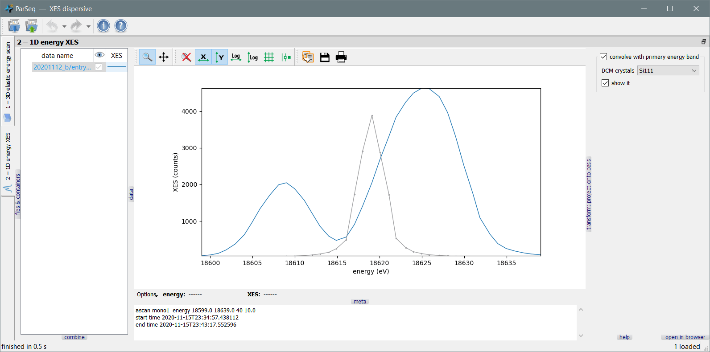

Dispersive XES
==============

A pipeline for the [ParSeq framework](https://github.com/kklmn/ParSeq) that
implements data processing of XES spectra measured in energy dispersive
geometry. The energy dispersive image is projected onto the base set of images
given by the scanned elastically scattered band.

This pipeline also serves as an example for creating analysis nodes, transforms
that connect these nodes and widgets that set options and parameters of the
transforms.

  

  

Dependencies
------------

* [ParSeq](https://github.com/kklmn/ParSeq) -- the framework package,
* [silx](https://github.com/silx-kit/silx) -- used for plotting and Qt imports.

How to use
----------

Either install ParSeq and this pipeline application by their installers or put
their folders near by (i.e. in the same folder), rename them as `parseq` and
`parseq_XES_dispersive` and run `python XES_dispersive_start.py`. You can try
it with `--test` to load test data and/or `--noGUI` but an assumed pattern is
to load a project file; use the test project file located in
`parseq_XES_dispersive/saved`.